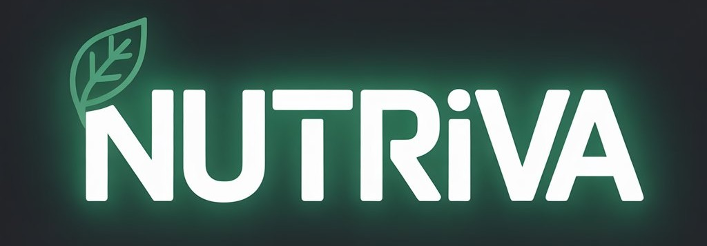

<div align="center">

<br />

<div align="center">
  
</div>

**Sistema clínico para nutriólogos modernos**

[](https://nextjs.org)
[](https://supabase.com)
[](https://www.typescriptlang.org)
[](https://tailwindcss.com)
[](LICENSE)

<br />

</div>

---

## ¿Qué es Nutriva?

Nutriva es una plataforma web diseñada para que los nutriólogos gestionen su práctica clínica desde un solo lugar — sin papeles, sin hojas de cálculo, sin caos. Desde el primer contacto con el paciente hasta su evolución a largo plazo.

<br />

## ✦ Funcionalidades

| Módulo                     | Descripción                                                                  |
| -------------------------- | ---------------------------------------------------------------------------- |
| 🧑‍⚕️ **Pacientes**           | Expediente digital completo con historial, datos de contacto y objetivos     |
| 📋 **Consultas**           | Registro de peso, talla, IMC, composición corporal y medidas antropométricas |
| 🥗 **Planes alimenticios** | Constructor visual de planes con cálculo automático de macros por comida     |
| ✨ **Plantillas**          | Planes reutilizables que se asignan a pacientes con un clic                  |
| 🍎 **Alimentos**           | Base de datos global + alimentos personalizados por nutriólogo               |
| 📅 **Citas**               | Calendario interactivo con vistas por día, semana y mes                      |
| 🖨️ **Impresión**           | Planes listos para imprimir o exportar como PDF                              |
| 📊 **Dashboard**           | Resumen diario, estadísticas y acceso rápido a lo más relevante              |

<br />

## ⚙️ Stack técnico

```
Frontend    →  Next.js 16 (App Router) + React 19
Auth / DB   →  Supabase (PostgreSQL + Row Level Security)
Estilos     →  Tailwind CSS v4 + shadcn/ui + Radix UI
Animaciones →  Framer Motion
Formularios →  React Hook Form + Zod
Gráficas    →  Recharts
Calendario  →  React Big Calendar
```

<br />

## 🚀 Inicio rápido

**1. Clona el repositorio**

```bash
git clone https://github.com/AmiiGood/Nutriva.git
cd nutriva
```

**2. Instala dependencias**

```bash
npm install
```

**3. Configura las variables de entorno**

Crea un archivo `.env.local` en la raíz del proyecto:

```env
NEXT_PUBLIC_SUPABASE_URL=https://tu-proyecto.supabase.co
NEXT_PUBLIC_SUPABASE_ANON_KEY=tu_anon_key
```

> Puedes obtener estas credenciales en tu proyecto de [Supabase](https://supabase.com/dashboard) → Settings → API.

**4. Inicia el servidor**

```bash
npm run dev
```

Abre [http://localhost:3000](http://localhost:3000) en tu navegador.

<br />

## 📁 Estructura del proyecto

```
src/
├── app/
│   ├── (auth)/          # Login, registro, recuperación de contraseña
│   ├── (dashboard)/     # Todas las vistas autenticadas
│   │   ├── dashboard/
│   │   ├── pacientes/
│   │   ├── planes/
│   │   ├── citas/
│   │   ├── alimentos/
│   │   └── configuracion/
│   └── auth/            # Callbacks de Supabase
├── components/ui/       # Componentes shadcn/ui
├── lib/supabase/        # Clientes de Supabase (server / client)
└── middleware.ts        # Protección de rutas
```

<br />

## 🗄️ Base de datos (Supabase)

Las tablas principales del proyecto:

```
nutriologos          → Perfil del nutriólogo
pacientes            → Expedientes de pacientes
consultas            → Historial de mediciones por paciente
planes               → Planes alimenticios asignados
plan_comidas         → Comidas dentro de un plan
comida_items         → Alimentos dentro de una comida
alimentos            → Base de datos de alimentos
plan_plantillas      → Plantillas reutilizables
plantilla_comidas    → Comidas dentro de una plantilla
plantilla_comida_items → Alimentos dentro de una comida de plantilla
citas                → Agenda de citas
```

<br />

## 🔐 Autenticación

Nutriva usa Supabase Auth con flujo de email/contraseña. El middleware protege todas las rutas del dashboard y redirige automáticamente según el estado de sesión.

Rutas públicas: `/login` · `/forgot-password` · `/auth/callback` · `/auth/reset-password`

<br />

## 📜 Licencia

MIT © 2025 — Libre para uso personal y comercial.

---

<div align="center">
  <sub>Hecho con 🥦 para nutriólogos que merecen mejores herramientas.</sub>
</div>
